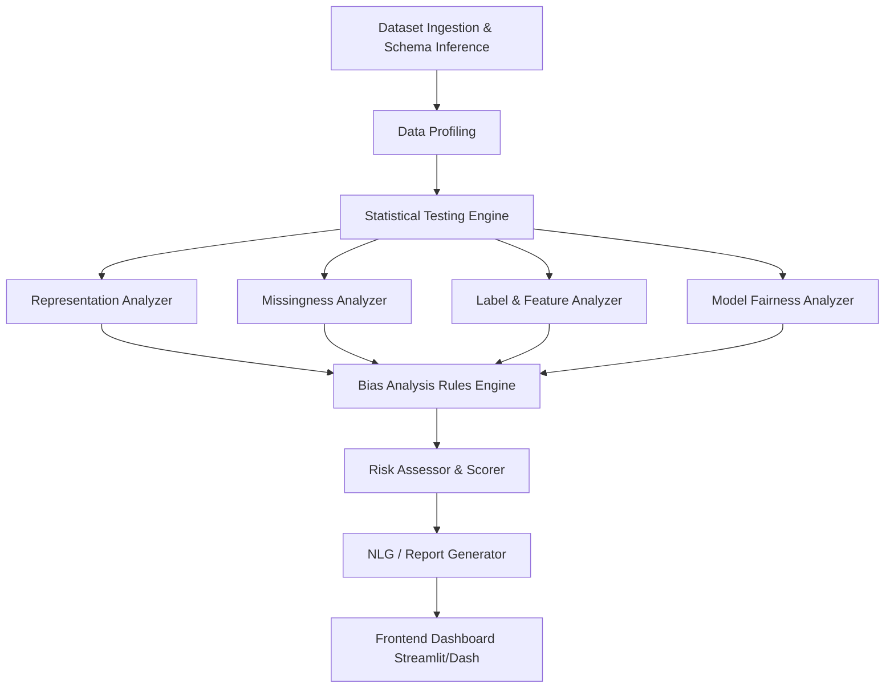

# System Architecture Specification

This document defines the high-level architecture of the Dataset Bias Detection Tool. The design enforces a strict separation of concerns, ensuring statistical calculations are fully decoupled from visualization and reporting.

## 1. High-Level Data Flow

## 2. Component Responsibilities

### A. Dataset Ingestion & Schema Inference
* **Responsibility**: Load tabular data (CSV, Parquet) via Pandas/Polars.
* **Key Tasks**: 
  * Automatically infer semantic data types (Continuous, Categorical, Boolean).
  * Allow user overriding of inferred types.
  * Identify potential "Protected Attributes" (e.g., columns named `gender`, `race`, `age_group`).

### B. Data Profiling
* **Responsibility**: Compute baseline descriptive statistics for all columns (mean, variance, cardinality, missingness percentage).
* **Key Tasks**: Segment these descriptive statistics by the identified protected attributes. (e.g., instead of just "Mean Income", compute "Mean Income grouped by Gender").

### C. Statistical Testing Engine (The Math Core)
* **Responsibility**: Execute rigorous inferential statistical tests.
* **Key Tasks**:
  * Expose standardized wrappers around `scipy.stats`.
  * Calculate Effect Sizes (Cohen's $w$, Cramer's $V$, Cohen's $d$).
  * Apply Benjamini-Hochberg False Discovery Rate (FDR) correction to $p$-values.
  * *Constraint*: This module does not know *what* it is testing (it knows nothing about bias), it only knows *how* to execute a mathematically valid test given two arrays.

### D. Bias Analyzers
* **Responsibility**: Formulate domain-specific hypotheses and utilize the Statistical Testing Engine.
* **Key Tasks**:
  * Each Analyzer (e.g., `MissingnessAnalyzer`) focuses on a specific risk category.
  * Yields un-scored `Finding` objects containing raw metrics.

### E. Rules Engine & Risk Assessor
* **Responsibility**: Evaluate the raw findings and assign severity.
* **Key Tasks**:
  * Apply predefined thresholds to Effect Sizes and corrected $p$-values.
  * Output a prioritized list of fully scored `Finding` objects and a composite "Risk Vector".

### F. Report Generator & Dashboard
* **Responsibility**: Humanize and visualize the results.
* **Key Tasks**:
  * Render Streamlit/Dash interfaces.
  * Generate Natural Language Generation (NLG) summaries for findings.
  * Provide downloadable PDF reports.
