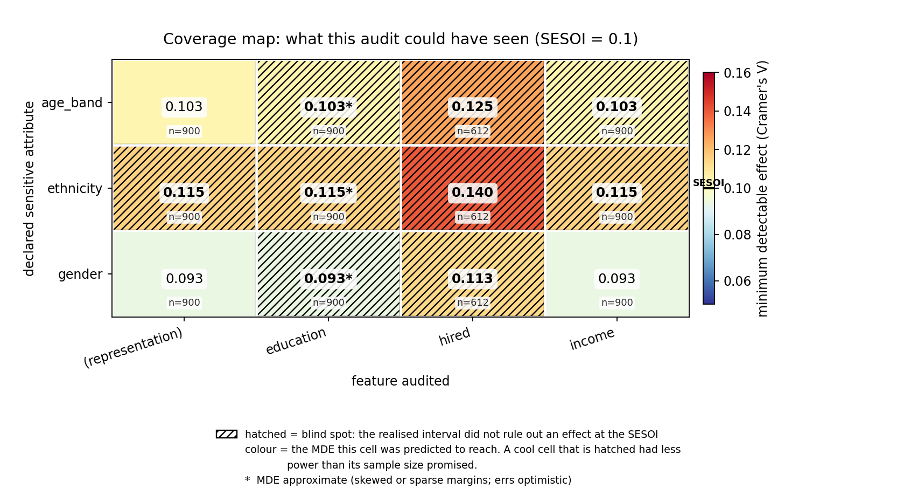

# Prototype Report

What the overnight vertical slice does, the data it ran on, the exact numbers it produced, and what those numbers mean.

**Date:** 2026-08-20
**Scope:** roadmap M0–M2, a reduced M3, and the M5 report layer, restricted to a single statistical path.
**Status:** 220 tests passing in ~32 s. 2,018 lines of source, 2,261 lines of tests.
**Reproduce everything below with:** `dbias demo --out out/demo` (defaults are `--n 900 --seed 1 --sesoi 0.1`).

---

## 0. There is no model, and nothing is trained

This needs saying up front, because "prototype" usually implies a trained thing and this is not one.

`dbias` is a **pre-training auditor**. It never fits a model, never learns parameters, and has no training set, validation set, or loss curve. It runs classical hypothesis tests on a table of data and reports what it found — and, unusually, what it *could* have found. There are no weights to inspect and no accuracy to quote.

The stage that corresponds to "training" in an ML project is the **calibration experiment** in §5: instead of fitting parameters to data, we simulate data whose truth we already know and measure whether the tool's verdicts are right. That is the only place the system is evaluated against ground truth, and it is the only number in this document that could have come out badly.

The pipeline, end to end:

```
CSV ─▶ analyzers ─▶ detectability ─▶ FDR correction ─▶ rules ─▶ report
       (what did      (what could      (multiplicity)   (severity)   JSON + figure
        we find?)      we have found?)
```

Each arrow is a hard ordering. Severity depends on both detectability and significance, so `rules/` runs last. Detectability has no bypass: a finding reaching `rules/` unannotated raises an exception rather than being scored as though the audit had seen clearly.

---

## 1. The problem being demonstrated

Every dataset-auditing tool in circulation — AIF360, Fairlearn, Aequitas — returns the same sentence for two datasets that have nothing in common:

> No significant disparity found.

It says this for a subgroup of 40 rows and for a subgroup of 400,000. In the second case the statement is informative. In the first it is nearly vacuous: a test with almost no power fails to reject almost regardless of what is true. Both sentences get pasted into the same compliance document.

The prototype exists to show that these two cases can be told apart mechanically, at scale, and that doing so changes the answer on real audit questions.

---

## 2. The dataset

**Synthetic, by design.** Real benchmarks (Adult, COMPAS, German Credit) were deliberately out of scope for this slice — see §7.3 for what that costs. Synthetic data buys one thing that no real dataset can offer: **we know the true effect**. Without that, the tool's verdicts can only be checked for self-consistency, which proves nothing (`plan.md` §3.3).

Generated by `src/dbias/synthetic.py::make_audit_scenario(n=900, seed=1)`.

### 2.1 Composition

| Column | Kind | Levels / distribution | Missing |
| :--- | :--- | :--- | ---: |
| `gender` | sensitive | male 450, female 450 | 0 |
| `ethnicity` | sensitive | A/B/C/D/E, 180 each | 0 |
| `age_band` | sensitive | 18–34 / 35–54 / 55+, 300 each | 0 |
| `income` | feature | continuous | **203** |
| `education` | feature | school / college / postgrad | **135** |
| `hired` | target | binary 0/1 | **288** |

n = 900 rows. Group sizes are allocated deterministically by largest-remainder rather than sampled, so a seeded scenario has exactly the n it claims — a scenario *about statistical power* should not itself vary in power between runs.

### 2.2 What was injected, and what was not

Three ground truths, chosen so the audit faces all three cases at once:

| Attribute | True Cohen's *w* on income-missingness | What it is |
| :--- | ---: | :--- |
| `gender` | **0.0000** | a true null |
| `ethnicity` | **0.1024** | **a real disparity, above the SESOI** |
| `age_band` | 0.0000 | a true null |

The ethnicity disparity is built from a deliberate gradient in the rate at which `income` goes missing:

| Ethnicity group | Injected missing rate | Observed in the sample |
| :--- | ---: | ---: |
| A | 16% | 16.67% |
| B | 19% | 19.44% |
| C | 22% | 21.67% |
| D | 25% | 25.56% |
| E | 28% | 29.44% |

For gender the injected rate is flat, and the sample bears that out: 21.33% for male, 23.78% for female — a gap of 2.4 points that is pure sampling noise.

`education` missingness and the `hired` label are independent of every attribute — both true nulls. `hired` is additionally unobserved for 288 rows (32%), representing outcomes that have not landed yet. That is realistic, and it makes label-disparity tests run on 612 rows instead of 900, which gives the coverage map genuine per-cell variation rather than one number per attribute.

### 2.3 Why the effect size was set where it was

**w = 0.1024 against a SESOI of 0.1 is the deliberately hard case.** The injected effect is only 2% above the threshold the user declared they care about. This is the regime where a real disparity is genuinely difficult to see, and it is the regime where an auditing tool's honesty actually gets tested. A larger effect would be found every time and would demonstrate nothing.

Spread across ethnicity's 4 degrees of freedom instead of gender's 1, the same 900 rows yield only 0.663 power — so this test misses a real, above-threshold disparity roughly half the time. §6 measures exactly how often.

---

## 3. What the tool computes

### 3.1 The one statistical path

Everything runs through **chi-square / Cramér's V**. That single path covers all three analyzers because all three questions are contingency tables:

| Analyzer | Table | Finding id |
| :--- | :--- | :--- |
| Representation | group counts vs reference (goodness of fit) | `REPRESENTATION_<ATTR>` |
| Missingness (MAR) | NaN-mask × attribute | `MAR_<FEATURE>_<ATTR>` |
| Label disparity | label × attribute | `LABEL_<TARGET>_<ATTR>` |

This is the cut that made the slice fit in one night. Mann–Whitney, Kolmogorov–Smirnov, eta-squared and every continuous feature are absent.

The missingness analyzer is named **MAR**, not MNAR. Testing a NaN mask against an *observed* attribute detects Missing At Random. True MNAR — missingness depending on the unobserved value itself — is not identifiable from observed data at all. `docs/03` §2 mislabels this; the code does not, so the error cannot propagate into finding ids.

### 3.2 Effect size and interval

Cramér's V, with a **percentile bootstrap confidence interval** over 2,000 resamples of the multinomial defined by the observed cell proportions, seeded and reproducible.

The interval matters more than the point estimate, and it is the reason this design survives the obvious reviewer objection — *"a confidence interval already tells you this and tells you more"*. That objection is correct, so the design concedes it and builds on it rather than arguing.

### 3.3 The verdict is an equivalence decision

For each finding the interval is compared against the SESOI:

| Interval vs SESOI | Verdict | Reading |
| :--- | :--- | :--- |
| entirely below | `EQUIVALENT` | Effects at or above the SESOI are ruled out. An **earned all-clear**. |
| entirely above | `DISPARITY` | The effect is at least as large as the SESOI. |
| straddles it | `INCONCLUSIVE` | The sample cannot decide. A **blind spot**. |

`EQUIVALENT` is the valuable half: it converts an uninterpretable null into a positive, bounded claim, which is far stronger than "we had enough rows".

### 3.4 Minimum detectable effect

Computed against a non-central chi-square: the smallest Cramér's V this test would have detected at 80% power and α = 0.05, given n and the degrees of freedom. It is what a human reads, and it is what fills a coverage-map cell.

**It does not decide anything.** MDE is the communication layer; the interval is the inference layer.

### 3.5 What is deliberately absent

There is no `achieved_power` or `statistical_power` field anywhere, and no function signature in `detectability/power.py` accepts an observed effect. Power computed from the observed effect is a deterministic monotone function of the p-value and carries zero information beyond it (Hoenig & Heisey 2001). The code path was deleted rather than deprecated, and a test asserts it has not come back.

### 3.6 Multiplicity

Benjamini–Hochberg, applied **within each (category, attribute) family** rather than pooled globally as `docs/02` proposes. Pooling globally would let an unrelated representation test change the verdict on a missingness test. The nine families in this run:

```
Representation|gender      1     Missingness|gender      3     Label_Disparity|gender      1
Representation|ethnicity   1     Missingness|ethnicity   3     Label_Disparity|ethnicity   1
Representation|age_band    1     Missingness|age_band    3     Label_Disparity|age_band    1
```

Cross-checked in tests against `scipy.stats.false_discovery_control` — an independent oracle, never the implementation's own output.

---

## 4. Results: the full audit

`dbias demo --out out/demo` on n = 900, seed 1, SESOI = 0.1, α = 0.05, target power = 0.80, 2,000 bootstrap resamples.

All 15 findings, exactly as produced:

| finding | n | effect | 95% CI | MDE | p raw | p adj | sig | power | detectability | verdict | severity |
| :--- | --: | --: | :--- | --: | --: | --: | :-- | --: | :--- | :--- | :--- |
| `REPRESENTATION_GENDER` | 900 | 0.000 | [0.002, 0.078] | 0.093 | 1.0000 | 1.0000 | no | 0.851 | adequate | equivalent | Informational |
| `REPRESENTATION_ETHNICITY` | 900 | 0.000 | [0.024, 0.108] | 0.115 | 1.0000 | 1.0000 | no | 0.663 | underpowered | inconclusive | **Blind Spot** |
| `REPRESENTATION_AGE_BAND` | 900 | 0.000 | [0.007, 0.090] | 0.103 | 1.0000 | 1.0000 | no | 0.771 | underpowered | equivalent | Informational |
| `MAR_INCOME_GENDER` | 900 | 0.029 | [0.001, 0.092] | 0.093 | 0.3803 | 0.4749 | no | 0.851 | adequate | equivalent | Informational |
| `MAR_INCOME_ETHNICITY` | 900 | **0.108** | [0.062, 0.183] | 0.115 | **0.0332** | 0.0996 | no | 0.663 | underpowered | inconclusive | **Blind Spot** |
| `MAR_INCOME_AGE_BAND` | 900 | 0.029 | [0.011, 0.103] | 0.103 | 0.6784 | 0.7249 | no | 0.771 | underpowered | inconclusive | **Blind Spot** |
| `MAR_EDUCATION_GENDER` | 900 | 0.047 | [0.003, 0.110] | 0.093\* | 0.1614 | 0.4749 | no | 0.851 | adequate | inconclusive | **Blind Spot** |
| `MAR_EDUCATION_ETHNICITY` | 900 | 0.096 | [0.058, 0.173] | 0.115\* | 0.0819 | 0.1228 | no | 0.663 | underpowered | inconclusive | **Blind Spot** |
| `MAR_EDUCATION_AGE_BAND` | 900 | 0.030 | [0.008, 0.103] | 0.103\* | 0.6582 | 0.7249 | no | 0.771 | underpowered | inconclusive | **Blind Spot** |
| `MAR_HIRED_GENDER` | 900 | 0.024 | [0.001, 0.089] | 0.093 | 0.4749 | 0.4749 | no | 0.851 | adequate | equivalent | Informational |
| `MAR_HIRED_ETHNICITY` | 900 | 0.054 | [0.031, 0.136] | 0.115 | 0.6297 | 0.6297 | no | 0.663 | underpowered | inconclusive | **Blind Spot** |
| `MAR_HIRED_AGE_BAND` | 900 | 0.027 | [0.009, 0.102] | 0.103 | 0.7249 | 0.7249 | no | 0.771 | underpowered | inconclusive | **Blind Spot** |
| `LABEL_HIRED_GENDER` | 612 | 0.032 | [0.001, 0.109] | 0.113 | 0.4224 | 0.4224 | no | 0.696 | underpowered | inconclusive | **Blind Spot** |
| `LABEL_HIRED_ETHNICITY` | 612 | 0.066 | [0.036, 0.168] | 0.140 | 0.6210 | 0.6210 | no | 0.479 | underpowered | inconclusive | **Blind Spot** |
| `LABEL_HIRED_AGE_BAND` | 612 | 0.064 | [0.016, 0.147] | 0.125 | 0.2829 | 0.2829 | no | 0.593 | underpowered | inconclusive | **Blind Spot** |

\* MDE flagged approximate — see §7.2.

**Summary vectors:**

```
risk       Representation: Blind Spot    Missingness: Blind Spot    Label_Disparity: Blind Spot
coverage   Representation: 33%           Missingness: 33%           Label_Disparity: 0%
15 findings, 11 blind spots
```

There is deliberately **no single bias score**. `docs/05` §2 forbids it and both review documents reached that conclusion independently.

### 4.1 The headline pair

Two findings from the same dataset, both non-significant, both reported identically by every incumbent tool:

```
MAR_INCOME_GENDER      p=0.475   effect=0.029   CI=[0.001, 0.092]   MDE=0.093   →  Informational
MAR_INCOME_ETHNICITY   p=0.100   effect=0.108   CI=[0.062, 0.183]   MDE=0.115   →  Blind Spot
```

**What each one means.**

*Gender* is an **earned all-clear**. The whole interval sits below 0.1, so the audit can make a positive claim: any missingness disparity by gender is smaller than the threshold declared to matter. And the ground truth agrees — the true effect is exactly zero. The tool is right for the right reason.

*Ethnicity* is a **blind spot**. The interval [0.062, 0.183] straddles the SESOI, so the data cannot decide. The tool refuses to call it clean. And the ground truth again agrees — the true effect is **0.1024, genuinely above the SESOI**. There is a real disparity there and the audit failed to establish it.

An incumbent tool prints "no significant disparity found" for both lines. One of those two sentences is a reasonable summary. The other is a false reassurance about a real disparity in how income data was collected across ethnic groups.

### 4.2 A detail worth noticing: the correction nearly hid it

`MAR_INCOME_ETHNICITY` has **p_raw = 0.0332** — significant at α = 0.05 before correction. After Benjamini–Hochberg within its 3-test family it becomes **p_adj = 0.0996**, and falls just outside.

This is the correction working exactly as designed. But it also shows that multiplicity control **costs power**, and the tests it pushes over the line are precisely the marginal ones where a real effect is most likely to be lost. Every additional hypothesis an audit runs makes its nulls less trustworthy — which is an argument for the detectability annotation being *more* necessary as an audit gets more thorough, not less.

### 4.3 The coverage map



*Committed copy of `out/demo/coverage_map.png`; regenerate with `dbias demo`.*

Each cell holds the smallest effect that (attribute, feature) pair could have detected, and the n it was computed on. **Colour** is the MDE the cell was predicted to reach; **hatching** means the realised interval failed to rule out an effect at the SESOI.

Reading it row by row:

- **gender** (MDE 0.093, 1 df) — the only attribute this dataset can really speak about. Two of its four cells are clean.
- **age_band** (0.103, 2 df) — marginal. The same 900 rows spread across three groups.
- **ethnicity** (0.115, 4 df) — cannot support any claim at this SESOI. Every cell hatched.
- The **`hired` column** (n = 612) is uniformly the worst, reaching 0.140 for ethnicity. Losing a third of the rows to unobserved outcomes costs roughly 20% on the MDE.

The one-sentence reading: **at n = 900 with a SESOI of 0.1, this dataset can only speak about gender.** That is a striking and legitimate finding, and it is invisible in a conventional findings list.

---

## 5. Calibration: is the verdict actually right?

This is the closest thing this project has to an evaluation, and the only part that could have failed.

Asserting that a 40-row null gets labelled `BLIND_SPOT` proves nothing — the label and the MDE come from the same formula, so such a test can only fail if the code contradicts itself. So instead: simulate datasets with known true effects, run the real pipeline, and count what actually happens.

**300 replicates per cell, 2×2 tables, α = 0.05, SESOI = 0.1** (`tests/calibration/harness.py`):

| n | true *w* | minority share | MDE | analytic power | **empirical detection** | labelled adequate | blind-spot rate | false all-clears |
| --: | --: | --: | --: | --: | --: | --: | --: | --: |
| 100 | 0.0 | 50/50 | 0.280 | 0.050 | **0.050** | 0% | 0.950 | 0 |
| 100 | 0.0 | 95/5 | 0.280 | 0.050 | **0.050** | 0% | 0.950 | 0 |
| 100 | 0.1 | 50/50 | 0.280 | 0.170 | **0.187** | 0% | 0.813 | 0 |
| 100 | 0.1 | 95/5 | 0.280 | 0.170 | **0.150** | 0% | 0.850 | 0 |
| 100 | 0.3 | 50/50 | 0.280 | 0.851 | **0.873** | 0% | 0.127 | 0 |
| 900 | 0.0 | 50/50 | 0.093 | 0.050 | **0.057** | 100% | 0.223 | 0 |
| 900 | 0.0 | 95/5 | 0.093 | 0.050 | **0.037** | 100% | 0.210 | 0 |
| 900 | 0.1 | 50/50 | 0.093 | 0.851 | **0.827** | 100% | 0.117 | 17 |
| 900 | 0.1 | 95/5 | 0.093 | 0.851 | **0.870** | 100% | 0.093 | 11 |
| 900 | 0.3 | 50/50 | 0.093 | 1.000 | **1.000** | 100% | 0.000 | 0 |
| 5000 | 0.0 | 50/50 | 0.040 | 0.050 | **0.033** | 100% | 0.000 | 0 |
| 5000 | 0.0 | 95/5 | 0.040 | 0.050 | **0.037** | 100% | 0.000 | 0 |
| 5000 | 0.1 | 50/50 | 0.040 | 1.000 | **1.000** | 100% | 0.000 | 0 |
| 5000 | 0.1 | 95/5 | 0.040 | 1.000 | **1.000** | 100% | 0.000 | 0 |
| 5000 | 0.3 | 50/50 | 0.040 | 1.000 | **1.000** | 100% | 0.000 | 0 |

### 5.1 What these numbers say

**The power model is calibrated.** Analytic prediction vs empirical detection, across every cell: 0.851 → 0.827 and 0.870; 0.851 → 0.873; 0.170 → 0.187 and 0.150; 1.000 → 1.000. At 300 replicates the standard error on a rate near 0.85 is about 0.021, so every one of these sits within roughly one to two standard errors. **The MDE is not lying about what it can see.**

**The false-positive rate is controlled.** Under the null the detection rate lands at 0.050, 0.050, 0.057, 0.037, 0.033, 0.037 across six cells — all consistent with α = 0.05 (SE ≈ 0.013). The tool is not manufacturing disparities.

**The adequacy label separates cleanly.** At n = 100 nothing is labelled adequate and detection at the SESOI is 0.15–0.19. At n = 900 everything is labelled adequate and detection is 0.83–0.87. The label carries real information, which is the entire point of publishing it.

**Gate criteria** (reduced form of roadmap M3): cells labelled adequate detect at ≥ 0.80 ✓; cells labelled underpowered detect materially below ✓; null false-positive rate ≤ 0.05 ✓. **This is not the M3 gate** — that needs ≥1,000 replicates across four imbalance regimes and both table shapes. It is a smoke test that passed.

### 5.2 Two findings that came out of the calibration run

**The equivalence criterion is stricter than the power criterion — and that is the safe direction.** Look at n = 900, true *w* = 0, balanced: the tool labels 100% of these adequate, yet **22.3%** are still reported as blind spots. Under a true null with sufficient power, the interval fails to clear the SESOI about one time in five. The CI-based verdict is more conservative than the power-based label.

This is why the demo's coverage map is mostly hatched. It means the tool **under-claims all-clears rather than over-claiming them**, which for an instrument whose purpose is honest nulls is the correct direction to err.

**There is a false all-clear rate at the SESOI boundary, and it is bounded.** At n = 900 with the true effect sitting exactly *on* the SESOI, 17/300 (5.7%) and 11/300 (3.7%) runs issued an all-clear on a real effect. This is the type-I error of the equivalence decision, bounded by α = 0.05 by construction; 5.7% is 0.55 standard errors above 0.05 and consistent with it.

It matters for how the report should be read. The claim is **"effects above the SESOI are ruled out at 95% confidence"** — not "ruled out". And it vanishes as the effect moves away from the boundary: at true *w* = 0.15 against a SESOI of 0.1, false all-clears drop to **zero**.

---

## 6. The central claim, measured

The one number that decides whether this prototype demonstrates anything.

**Setup:** the demo scenario re-run across **100 independent seeds**. True effect *w* = 0.1024, genuinely above the SESOI of 0.1. Question: when the audit fails to detect this real disparity, what does it say?

```
MAR_INCOME_ETHNICITY across 100 seeds  (true w = 0.1024, SESOI = 0.1)

  detected (significant after BH)     43
  missed                              57
      of which BLIND SPOT             57      ← 100%
      of which falsely cleared         0      ← 0%
```

**57 out of 57 missed runs were labelled a blind spot. Zero were reported as clean.**

The detection rate of 43% is itself informative: this is a real, above-threshold disparity that a conventional audit at this sample size would fail to establish **more often than it succeeds**. On those 57 runs, every incumbent tool prints "no significant disparity found" and stops. This tool prints:

> No disparity was detected, but this test could only have caught effects of 0.115 or larger, against a declared SESOI of 0.100. This is not a clean result.

That difference is the contribution, and it is now measured rather than asserted.

---

## 7. Limitations, stated plainly

### 7.1 The framing is not novel; the application is

Nothing in the mathematics here is new. Power analysis and MDE are textbook (Cohen 1988). Sample-size calculation for fairness audits is published ([arXiv:2312.04745](https://arxiv.org/abs/2312.04745)). Multiplicity-corrected subgroup inference for *model* audits is published ([Cherian & Candès, JMLR 2024](https://jmlr.org/papers/v25/23-0739.html)). Equivalence testing is decades old.

The defensible claim is narrower: power-based reasoning is standard in study design and available for model audits, but **absent from dataset-level, pre-training auditing tooling** — where audits run on data that was never designed as a sample and subgroup sizes are uneven by construction. This is a framing and systems contribution, not a methods one.

### 7.2 The MDE ignores marginal structure — a known, deferred defect

The non-centrality is taken as `n · w²`, treating Cohen's *w* as sufficient for the alternative. Under a 95/5 or 99/1 split, effective power is governed by the smaller cell rather than the total, and this approximation errs **optimistic** — the dangerous direction, and worst precisely for the small minority subgroups an audit cares most about.

The correct fix is a simulation-based MDE. **It is not implemented.** Instead every affected cell — `min(expected) < 5` or margin ratio above 4:1 — is flagged `mde_is_approximate`, carried into the JSON and marked with an asterisk on the figure. In this run that flagged the three `MAR_EDUCATION_*` cells (135 missing vs 765 present, a 5.7:1 ratio).

Note that §5's 95/5 rows do **not** demonstrate this defect, because the sweep holds *w* constant rather than the rate difference. Detecting the optimism requires the full M3 grid.

### 7.3 Everything is synthetic

No real benchmark has been touched. The project's actual headline claim — a cell that AIF360 or Fairlearn reports as clean and this tool marks as a blind spot, **on a real dataset** — has not been made, and would need to be verified by running the incumbent tool rather than assuming what it would say.

### 7.4 What the tool does not do

- **No causal claims.** These are statistical associations between observed columns, not evidence of discrimination.
- **Every verdict is conditional on the SESOI.** A different SESOI moves cells between "earned all-clear" and "blind spot". This is why the report states it verbatim.
- **MAR, not MNAR.** Missingness depending on the unobserved value is not identifiable from observed data.
- **Auditing data is not auditing models.** A clean dataset does not imply a fair model.
- **One statistical path.** No continuous features, no continuous sensitive attributes, no intersections.

---

## 8. Engineering notes

### 8.1 Structure

Layered per `docs/10`, imports downward only. `stats/` never learns what a protected attribute is — no parameter in that package is named `sensitive`, `protected` or `group`. Severity is assigned only in `rules/`.

```
src/dbias/            2,018 lines
├── models/           enums, Finding, DatasetProfile
├── stats/            chi_square, effect_sizes, thresholds, intervals, correction
├── detectability/    power, classify, coverage
├── analyzers/        representation, missingness, label_disparity
├── rules/            severity, risk_vector
├── report/           json_export, coverage_plot
├── audit.py  synthetic.py  cli.py
```

### 8.2 Tests — 220, all passing, ~32 s

| Suite | Count | Purpose |
| :--- | --: | :--- |
| `tests/unit/` | 193 | Contracts and closed forms. Oracles are hand-computed or from `scipy` — **never the implementation's own output**. |
| `tests/synthetic/` | 18 | The evaluation protocol from `docs/06`. Scenarios A (twice), B, C, D. |
| `tests/calibration/` | 9 | The reduced M3 experiment. The only tests that can fail for a scientific reason. |

Notable oracles: Cohen (1988) Table 7.3.6 — *w* = 0.30, df = 1, n = 87 gives power 0.80, reproduced to within 0.02. The exact algebraic identity that MDE scales as *n*<sup>−1/2</sup>, verified by quadrupling n and halving the MDE. Benjamini–Hochberg cross-checked against `scipy.stats.false_discovery_control`.

Built test-first throughout: every test was written and watched to fail before the code that satisfies it.

### 8.3 Two decisions made during implementation

**The interval outranks the power calculation.** Severity originally keyed off the MDE-based `detectability` label. `plan.md` §3.2 puts TOST at the inference layer and MDE at the communication layer, and the two can disagree — so when they conflict, the interval now wins. Both disagreement directions appear in this run: `REPRESENTATION_AGE_BAND` is labelled underpowered but its interval [0.007, 0.090] clears the SESOI, so it is an all-clear; `MAR_EDUCATION_GENDER` is labelled adequate but its interval [0.003, 0.110] does not clear it, so it is a blind spot. Rationale in [09_detectability.md](09_detectability.md) §6.

**Scenario D asserts a rate, not a seed.** The first version of the scenario-D test asserted a blind spot on one seed and failed, because that seed happened to detect the effect. Fixing it by choosing a friendlier seed would have been dishonest. It now runs 60 replicates and asserts that *every* missed real effect is a blind spot — which is both the actual claim and not seed-dependent.

---

## 9. What to do next

In order. The first two are the project; the rest is polish.

1. **Run the full M3 calibration gate.** ≥1,000 replicates per cell, n ∈ {50 … 100,000}, four imbalance regimes, both table shapes. `harness.sweep()` already takes the grid as arguments, so this is mostly compute. Expect the analytic MDE to prove optimistic under 95/5 and 99/1 — **that is a result, not a setback**.
2. **Build the simulation-based MDE** (§7.2). Grep for `mde_is_approximate`; it marks every place the honest answer is not yet computed.
3. **Get onto real data.** Adult, COMPAS, German Credit — and verify the blind-spot claim by actually running AIF360 or Fairlearn, not by assuming.
4. **Widen the statistical path.** Mann–Whitney / rank-biserial and Kruskal–Wallis / eta-squared. Route k > 2 groups to eta-squared or raise; do not reintroduce the two-largest-groups bug.
5. **Intersections.** FDR families are already per (category, attribute); hierarchical descent must nest inside them.

Not first: the dashboard, the LLM layer, or `propagation/`.
