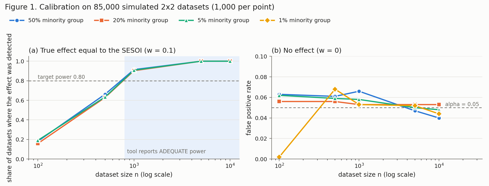
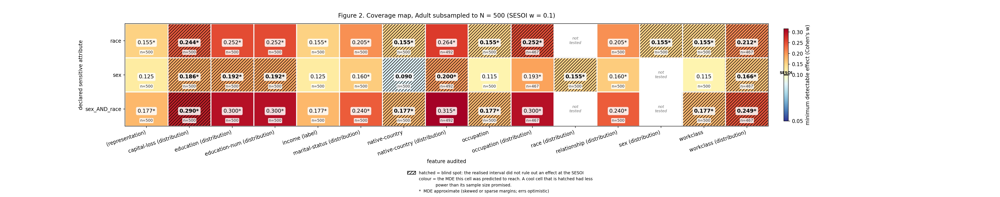

# Blind Spots in Dataset Bias Audits: Reporting What a Test Could Have Found

**Draft, M8.** Tools / applied track. Every number in this document is produced by a seeded script in the repository; §9 lists them.

---

## Abstract

Dataset bias audits report non-significant results the same way regardless of how much data stood behind them: a subgroup of 40 rows and a subgroup of 400,000 both come back as "no significant disparity found". The first statement is close to vacuous, yet both end up quoted in the same compliance documents. We describe `dbias`, a pre-training dataset auditor that attaches a *detectability* verdict to every finding. The user declares a smallest effect size of interest (SESOI); each null result is then classified, by an equivalence decision on a bootstrap confidence interval, as either an **earned all-clear** (effects at or above the SESOI are ruled out) or a **blind spot** (the sample could not tell). The audit emits an attribute × feature **coverage map** of minimum detectable effects alongside its findings. We test the verdict empirically rather than by construction. On 85,000 simulated datasets, cells the tool declared adequately powered detected an effect at the SESOI at least 90.3% of the time, against a target of 80%. False all-clears occurred only when the true effect sat exactly on the SESOI boundary (at most 3.2% per cell). On the Adult benchmark subsampled to 500 rows, the tool flags 19 of 41 tests as blind spots, including a missingness disparity that a demographic-parity check reads as a 16.7% gap with no indication that the data cannot support a conclusion. We also report two extensions — a bias-corrected effect size and hierarchical false discovery rate control over intersections — that failed pre-registered calibration gates and were removed. Nothing in the underlying statistics is new; the contribution is making detectability a mandatory, calibrated part of dataset-level audit output.

---

## 1. The null-result problem

Fairness toolkits such as AIF360 and Fairlearn compute group metrics and, where they test, report whether a difference is statistically significant. For a dataset audit, a non-significant result is the common case and the dangerous one. Audit data was never designed as a sample: nobody chose n, subgroup sizes are uneven by construction, and the groups an audit is meant to protect are usually the smallest. The cells where a test is least able to see are therefore the cells someone is relying on it to check.

"Absence of evidence is not evidence of absence" has a standard remedy — equivalence testing — that is routine in clinical trial design. It is absent from dataset-level auditing tools. Their output does not distinguish a null result that rules a disparity out from one that rules nothing out, and in practice the two get read the same way.

This work makes that distinction a required part of every finding. We do not claim new statistics. Power analysis and minimum detectable effects are textbook (Cohen, 1988); sample-size planning for fairness audits is published (arXiv:2312.04745); simultaneous inference for model audits is published (Cherian & Candès, 2024). The contribution is narrower:

> Power-based reasoning is standard in study design and available for *model* fairness audits, but absent from *dataset-level, pre-training* auditing, where data was never designed as a sample and subgroup sizes are uneven by construction. We make detectability a mandatory field on every finding, define a blind-spot verdict as an equivalence decision against a declared SESOI, expose an attribute × feature coverage map as a first-class audit artefact, and measure empirically whether the verdict is calibrated.

## 2. Formulation

### 2.1 Every finding carries both directions of error

A finding is one hypothesis — for example, "the missingness of `workclass` depends on `race`". It reports what the sample showed (effect size, confidence interval, corrected p-value) and what the sample could have shown (power to detect the SESOI, minimum detectable effect, equivalence verdict, detectability). The detectability pass is not optional. A finding that reaches the severity rules without it raises an error rather than being scored as if the audit had seen clearly.

### 2.2 The SESOI is required configuration

Every verdict is conditional on one number, the smallest effect size of interest, declared on the Cohen's *w* scale. It has no default. The audit's central claim is "we could have caught anything that matters", and a tool making that claim has to make the user say what matters. Defaulting to Cohen's conventions would put a rule of thumb — one Cohen described as a last resort — at the centre of a document carrying the user's name. The report states the SESOI verbatim, with its scale.

Effect sizes for contingency tables are reported as Cramér's V, which differs from *w* by a factor of sqrt(min(r−1, k−1)). Every comparison between a finding and the SESOI converts between the two; an early version that compared V directly against a *w*-scale SESOI under-graded every table with more than two groups.

### 2.3 The verdict is an equivalence decision

The inference layer is the confidence interval. For each finding, a seeded percentile bootstrap interval on the effect size is compared with the SESOI on the same scale:

| Interval relative to the SESOI | Verdict | Severity of a non-significant finding |
|---|---|---|
| entirely below | `EQUIVALENT` | **earned all-clear** (informational) |
| straddles it | `INCONCLUSIVE` | **blind spot** |
| entirely above | `DISPARITY` | **blind spot** |

Only `EQUIVALENT` earns an all-clear. The third row matters in practice: Cramér's V is biased upward near zero, so on sparse tables a non-significant finding can have an interval that sits above the SESOI. Such an interval has not ruled the SESOI out, and the tool scores it as a blind spot rather than falling back on the power calculation (§6.1 explains why this bias is not simply corrected).

### 2.4 The minimum detectable effect communicates; it does not decide

The minimum detectable effect (MDE) is the smallest effect the test would detect with the target power (0.80) at α = 0.05. It is what a coverage-map cell shows, and what the report's sentence says:

> No disparity was detected, but the test was not powered to detect the SESOI (w = 0.100); it could only have caught w = 0.155 or larger. This is not a clean result.

The MDE and the interval can disagree, because the MDE is a design-stage quantity computed from n while the interval is computed from the sample that arrived. When they disagree the interval wins, in both directions. Power is never computed from the observed effect: post-hoc "observed power" is a monotone function of the p-value and carries no information beyond it (Hoenig & Heisey, 2001). There is no code path by which an observed effect reaches a power calculation.

For 2x2 tables with skewed margins (smallest expected count below 5, or a margin ratio above 4:1) the analytic power calculation is optimistic, and the tool switches to simulation: binomial draws under the observed margins, run through the same uncorrected chi-square test the audit performs. Larger tables in that regime keep the analytic value and are flagged as approximate.

## 3. The system

`dbias` audits a tabular dataset given a list of sensitive columns, an optional outcome column and a SESOI. The pipeline is strictly ordered:

1. **Analyzers** generate hypotheses. Four are implemented: *representation* (group shares against a reference, uniform by default), *missingness* (does a column go missing more often in some groups — a MAR test), *feature disparity* (does a categorical feature with at most 20 levels distribute differently across groups), and *label disparity* (does the outcome rate differ across groups).
2. **Intersections.** Every pair of sensitive attributes produces a combined attribute (for example `sex_AND_race`), tested in its own right. A row missing either parent value is missing in the intersection, rather than forming a group called "nan".
3. **Detectability** annotates every hypothesis with its interval, power, MDE and verdict. If a parent attribute was underpowered and the intersection is too, the bootstrap is skipped and the cell is reported as a blind spot with no interval, never an invented one.
4. **Correction.** Benjamini–Hochberg within each (category, attribute) family.
5. **Rules** assign severity. Significant findings are graded by magnitude against multiples of the SESOI (1×, 3×, 5×); non-significant findings become all-clears or blind spots by §2.3.

The output is a JSON report and a figure. The report carries the SESOI and α in its configuration, a **risk vector** (worst severity per category) always paired with a **coverage vector** (the share of each category's cells that are not blind spots), every finding, and a limitations section that travels with the file. There is deliberately no single bias score.

### 3.1 The coverage map

The coverage map (Figure 2) is an attribute × feature grid. Each cell holds the MDE for that pair on the SESOI's scale, the n it was computed on, an asterisk where the MDE is approximate, and hatching where the verdict was a blind spot. Colour is the MDE, centred on the SESOI: cool cells could see effects at the SESOI, warm cells could not. A cool cell that is hatched had less power than its sample size promised. Untested pairs are labelled "not tested", never filled with a default. Missingness, feature-distribution and label tests on the same column occupy separate cells, so one cannot overwrite another.

The map answers, in one image, the question a findings list cannot: which parts of this dataset is the audit entitled to speak about at all?

## 4. Calibration experiment

Asserting that a 40-row null returns "blind spot" proves nothing: the label and the MDE come from the same formula, so such a test can fail only if the code contradicts itself. The claim worth testing is empirical and can fail:

> When the tool says a test was adequately powered, the real detection rate at the SESOI is at least the target power; when it says the test was underpowered, the real rate is materially below it. And when there is no effect, the test keeps its advertised false positive rate.

**Design.** We simulated 2x2 missingness tables — a binary group against a binary "value is missing" indicator — with a known Cohen's *w*, and ran the full audit pipeline on each. The grid crossed n ∈ {100, 500, 1,000, 5,000, 10,000}, true *w* ∈ {0, 0.05, 0.10, 0.15, 0.20} and minority share ∈ {50%, 20%, 5%, 1%}, with 1,000 replicates per reachable cell: 85 cells and 85,000 datasets. (Combinations whose group rates would leave [0.01, 0.99] cannot exist and were skipped; that excludes, for example, *w* = 0.1 with a 1% minority.) SESOI was *w* = 0.1.

*Figure 1. (a) Detection rate when the true effect equals the SESOI, by n and minority share; the shaded region is where the tool declared the test adequately powered. (b) False positive rate under no effect. Each point is 1,000 simulated datasets.*

**Results.**

| n | Tool's verdict at w = SESOI | Detection rate (50% / 20% / 5% minority) |
|---|---|---|
| 100 | underpowered | 0.182 / 0.159 / 0.191 |
| 500 | underpowered | 0.662 / 0.629 / 0.634 |
| 1,000 | adequate | 0.914 / 0.903 / 0.908 |
| 5,000 | adequate | 1.000 / 1.000 / 1.000 |
| 10,000 | adequate | 1.000 / 1.000 / 1.000 |

- **Power claims hold.** In all 51 cells where the tool declared adequate power, an effect at or above the SESOI was detected at least 90.3% of the time. Where it declared the test underpowered, detection at the SESOI was 16–66%.
- **False positive rate.** Under no effect the rate averaged 5.2% across all cells, ranging from 0.2% (n = 100 with a 1% minority, where the test is conservative) to 6.8%. At n = 500 it averaged 6.1%, slightly above nominal.
- **False all-clears.** An earned all-clear on a real effect occurred only when the true effect sat exactly on the SESOI: 136 of 15,000 such datasets, at most 3.2% per cell, and never at any larger effect. This is the type-I error of the equivalence decision at its boundary, bounded by α by construction. The report's all-clear therefore reads "effects above the SESOI are ruled out at 95% confidence", not "ruled out".

## 5. Benchmark evaluation

All runs use SESOI *w* = 0.1 and a fixed seed.

**Known findings are recovered.** On Adult (N = 32,561), the high-income rate is 10.9% for women and 30.6% for men (V = 0.216, significant after correction). On COMPAS (N = 7,214), the recidivism rate is 55.1% for African-American and 41.8% for Caucasian defendants (V = 0.146, significant).

**Full-size benchmarks.**

| Dataset | Findings | Blind spots | High severity |
|---|---|---|---|
| Adult (N = 32,561) | 35 | 0 | 4 |
| COMPAS (N = 7,214) | 116 | 3 | 3 |

At N = 32,561 every Adult test is powered to see an effect at the SESOI. COMPAS has three blind spots, all on `vr_charge_degree` — a column recorded only for the 819 people with a violent recidivism charge, in which two race groups have four people each. A full-size benchmark can hide a blind spot wherever a feature is recorded for only a small subset of rows: the problem is small *effective* n, not small n.

**Small-n audit.** Adult subsampled to 500 rows yields 19 blind spots among 41 findings: four missingness tests, ten feature-distribution tests and five intersections whose bootstrap was skipped. Figure 2 is the tool's own coverage map for this run.

*Figure 2. Coverage map for Adult subsampled to N = 500. Cells show the MDE (Cohen's w) and n; hatched cells are blind spots; asterisks mark approximate MDEs.*

**Comparison with an incumbent tool.** For the missingness of `workclass` by race in the 500-row sample, Fairlearn's `MetricFrame` reports missingness rates of 0%, 0%, 7.1%, 16.7% and 6.7% across the five race groups and a demographic-parity difference of 0.167. Nothing in that output indicates whether the data could support a conclusion, and a chi-square test on the same counts is far from significant (p = 0.657) — the combination most easily recorded as a passed check. `dbias` reports a blind spot: the interval on the effect is [0.052, 0.207] in V, straddling the SESOI, and the test could only have detected effects of *w* = 0.155 or larger.

**A pre-registered negative result on COMPAS.** We asked whether the COMPAS blind spots would meet a stronger criterion: a cell in a *full-size* benchmark that an incumbent tool certifies as clean. Before running it we fixed the rule: for each level of the feature, the group rates must stay within four-fifths of each other, and the incumbent calls the cell clean only if every level passes. Fairlearn's demographic-parity metrics flag all three cells as *unfair* instead. In the sex cell, level `(F1)` has rates of 1.9% for women and 5.0% for men (2 of 105 against 36 of 714); in the race cell the same level ranges from 0% to 25% (one of four Asian defendants). On these cells the incumbent's failure is the opposite one — raising alarms from counts this small — so they do not demonstrate a false certification, and the headline comparison rests on the subsampled case above.

## 6. What did not work

Two extensions were built with pre-registered calibration gates, failed them, and were removed. We report them because both failures are informative and because the gates are what caught them.

### 6.1 Bias-corrected Cramér's V

The plug-in V is biased upward near zero: a 16 × 2 table at n = 500 with no association at all shows V ≈ 0.17. On sparse tables this inflates severity (`education` by race grades High at N = 500 with V = 0.265, but Low on the full data with V = 0.075) and puts whole intervals above the SESOI. We replaced it with the bias-corrected estimator of Bergsma (2013) and a bootstrap interval recentred by its estimated bias, then calibrated the interval on tables up to 16 × 2 and 14 × 5.

It removed the spurious disparities: under no effect, at most 2.3% of intervals sat above the SESOI, against up to 100% for the plug-in interval. But it over-corrected. With the true effect at the SESOI, the interval cleared it in up to 13.2% of tables, including 12.4% of ordinary 2x2 tables at n = 500, against a pre-registered limit of 5%. Through the full pipeline it roughly tripled false all-clears on the calibration grid (136 to 404 of 15,000). The plug-in interval errs toward blind spots, the corrected one toward false all-clears; only the first is acceptable for this tool, so the plug-in interval stays and the inflation is reported as a limitation. A correct interval for V near zero — for example, by inverting the non-central chi-square — remains open.

### 6.2 Hierarchical FDR over intersections

Intersections multiply the number of tests. A natural remedy is hierarchical FDR control (Yekutieli, 2008): test an intersection only if one of its parent attributes showed a disparity. We implemented it as an option and measured it on 500 simulated audits per scenario, with two binary attributes and ten features under four ground truths: no effects; main effects of one attribute; intersection-only (XOR) effects; and a mix.

| Scenario | Procedure | Worst per-family FDR | Audit-wide FDR | Intersection power |
|---|---|---|---|---|
| no effects | per-family (default) | 0.042 | 0.098 | — |
| no effects | hierarchical | **0.082** | 0.082 | — |
| XOR | per-family (default) | 0.064 | 0.040 | 1.000 |
| XOR | hierarchical | 0.064 | 0.074 | **0.017** |

The pre-registered gate — every family's FDR within α + 2 SE — passed for the default per-family correction in all four scenarios and failed for the hierarchical one: under no effects its intersection family reached 0.082 against a limit of 0.074. The cause is structural. An intersection's table refines its parents' tables, so the tests are positively dependent; admitting an intersection only after a chance parent rejection selects exactly the samples whose imbalance also makes the intersection look significant. Yekutieli's guarantee assumes independence between levels that this tree does not have. Hierarchical testing also lost 98% of the power to detect intersection-only effects. It was removed; the default per-family correction stays.

## 7. Limitations

- **Association, not causation, and not discrimination.** Every finding is a statistical association between observed columns. The tool does not detect discrimination, does not establish cause, and does not mitigate anything.
- **Every verdict is conditional on the declared SESOI.** A different SESOI moves cells between earned all-clear and blind spot. The tool cannot choose it for the user, and a poorly chosen SESOI produces confident but irrelevant verdicts.
- **An all-clear is a 95% statement.** At an effect exactly on the SESOI, up to 3.2% of datasets in our grid received an all-clear on a real effect.
- **MDE approximations degrade under extreme skew.** The analytic MDE errs optimistic under skewed margins. Simulation corrects this for 2x2 tables only; larger tables in that regime are flagged approximate, not corrected.
- **Effect sizes are inflated on sparse tables.** The plug-in Cramér's V overstates association on large, sparse tables, which inflates severity grades and intervals at small n (§6.1). The inflation errs toward blind spots, never toward all-clears, but magnitudes from such tables should not be read at face value.
- **FDR is controlled within families, not across the audit.** With several attributes, the chance of some false discovery somewhere exceeds α (about 10% under no effects with two attributes and intersections, §6.2).
- **The test is slightly liberal at moderate n.** The false positive rate averaged 6.1% at n = 500 in the calibration grid.
- **Calibration covers 2x2 tables up to n = 10,000.** For larger tables, the production interval's false-all-clear rate has not been measured; the larger-table experiment in §6.1 measured the rejected corrected interval, and for the production interval only its spurious-disparity rate.
- **Scope.** Only categorical sensitive attributes and categorical features (at most 20 levels) are tested; continuous features and continuous sensitive attributes have no path. Missingness tests detect MAR — dependence on an observed attribute — and cannot detect MNAR, which is not identifiable from observed data. The tool audits data, not models; a clean dataset does not imply a fair model.

## 8. Related work

Fairness toolkits (AIF360, Fairlearn, Aequitas) compute group metrics for datasets and models, generally without a statement of what a null result can support. Sample-size planning for fairness audits (arXiv:2312.04745) addresses detectability before data is collected; this work addresses it after, on data whose size was not chosen. Cherian & Candès (JMLR 2024) give simultaneous, multiplicity-corrected inference over subgroups for model audits; our setting is dataset-level and our contribution is an output contract rather than an inference procedure. Equivalence testing and the two one-sided tests procedure are standard in clinical trials. Hoenig & Heisey (2001) explain why observed power must not be reported. Hierarchical FDR over a hypothesis tree is Yekutieli (2008); §6.2 documents why its guarantee does not transfer to an intersection tree. Bergsma (2013) gives the bias-corrected Cramér's V evaluated in §6.1.

## 9. Reproducibility

Every number above comes from a seeded script in the repository:

| Result | Command |
|---|---|
| Figure 1, §4 table | `cd tests/calibration && PYTHONPATH=. python run_m3_gate.py --jobs 6` |
| §5 benchmark tables, Figure 2 | `python run_adult.py`, `python run_compas.py`, `python run_subsampled.py` |
| Fairlearn comparison (§5) | `pip install -e .[bench]` then `python compare_fairlearn.py` |
| COMPAS four-fifths comparison (§5) | `python benchmarks/compare_compas.py` |
| §6.1 interval calibration | `cd tests/calibration && python run_interval_gate.py --jobs 8` (results: `results/interval_calibration_results.csv`; the corrected interval is reproducible at commit `8019865`) |
| §6.2 FDR calibration | `cd tests/calibration && python run_fdr_gate.py --jobs 8` (per-family rows; hierarchical rows reproducible at commit `649da32`) |
| Both figures | `python docs/paper/make_figures.py` |

Calibration cells are seeded individually, so `--jobs` changes run time, not results.

## References

- Bergsma, W. (2013). A bias-correction for Cramér's V and Tschuprow's T. *Journal of the Korean Statistical Society*, 42(3), 323–328.
- Cherian, J. J., & Candès, E. J. (2024). Statistical inference for fairness auditing. *Journal of Machine Learning Research*, 25.
- Cohen, J. (1988). *Statistical Power Analysis for the Behavioral Sciences* (2nd ed.). Lawrence Erlbaum.
- Hoenig, J. M., & Heisey, D. M. (2001). The abuse of power: The pervasive fallacy of power calculations for data analysis. *The American Statistician*, 55(1), 19–24.
- Yekutieli, D. (2008). Hierarchical false discovery rate–controlling methodology. *Journal of the American Statistical Association*, 103(481), 309–316.
- *A Brief Tutorial on Sample Size Calculations for Fairness Audits.* arXiv:2312.04745.
